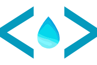

    

<h2 align="center">Sui Cohesive</h2>

  Integrated Development Environment for Sui.
   
<b>Explorer</b> | <b>Wallet</b> | <b>Editor</b>

A Secondary Plugin for the Cohesive Platform. It implements the explorer, and wallet specific for the Sui Platform.

By integrating these tools with the already feature-rich IDE provided by Cohesive, developers can now enjoy a
comprehensive and efficient reduced-context-switching development experience for Sui projects. Whether you're exploring the Sui platform
or managing your digital assets, the Secondary Plugin empowers you with the necessary resources to streamline your Sui
development process.
